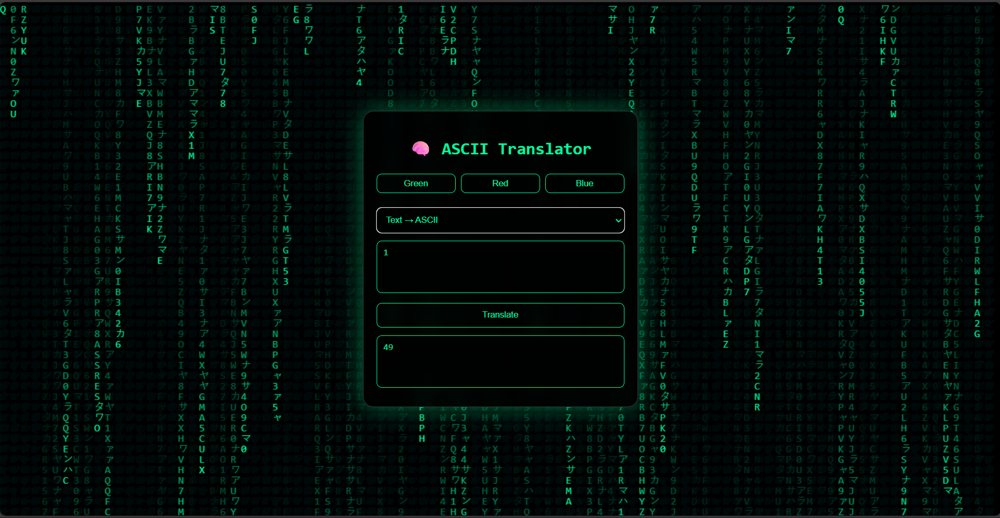

[](https://chiragsinh02004.github.io/matrix-ascii-translator/)


[](https://chiragsinh02004.github.io/matrix-ascii-translator/)


# 🧠 Matrix ASCII Translator

A cyber-style **ASCII ↔ Text translator** inspired by *The Matrix*.

Built using **pure HTML, CSS, and JavaScript** — no libraries, no frameworks.

---

## ✨ Features

✔ ASCII → Text  
✔ Text → ASCII  
✔ Authentic Matrix falling-code animation  
✔ Green / Red / Blue Matrix modes  
✔ Glassmorphism cyber UI  
✔ Mobile-friendly layout  
✔ No external libraries  

---

## 🖥️ Demo

Open `index.html` in your browser  
(or enable GitHub Pages)

---

## 📁 Project Structure

matrix-ascii-translator/
│── index.html
│── style.css
│── script.js

---

## 🛠️ Technologies Used

- HTML5
- CSS3 (Glassmorphism)
- JavaScript (Canvas API)

---

## 📸 Preview

> Matrix-style cyber ASCII translator with animated background

---

## 🚀 How to Run

1. Clone the repository:
   ```bash
   git clone https://github.com/ChiragSinh02004/matrix-ascii-translator.git
2. Open index.html in a browser


